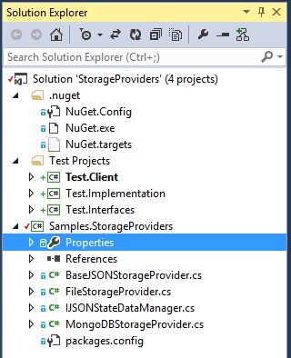



## Storage Providers

**Note**: This sample requires the "Official MongoDB C# Driver" NuGet package from 10gen, Inc. If you want to run the sample and store data using MongoDB, you will also need to [download](https://www.mongodb.org/) and install MongoDB. 

Custom storage providers allow you to extend the capabilities of Orleans to store application data in new storage services. In this sample, we have code to store data in a file system (presumably networked) and in MongoDB.

While binary formatting is almost always better to use for persistent storage, this sample chooses to use JSON as the external format for one reason: it's easier to read and verify, which is a good thing in a sample. As you adopt the sample code for more realistic use, you will probably want to switch to something else than JSON as the external format.

### Running the sample
The sample solution consists of four projects -- the storage provider library, and three test libraries, with the same client+server structure that the  Hello World sample has.

1. Edit the `DevTestServerConfiguration.xml` file in the Test.Client project, uncommenting the element of the file-storage provider.

      <!-- To test the sample storage providers, uncomment one of the following two lines:
      <Provider Type="Samples.StorageProviders.MongoDBStorage" 
                Name="TestStore"
                Database="orleanssamples"
                ConnectionString="mongodb://localhost:27017/" />
      -->
      <Provider Type="Samples.StorageProviders.OrleansFileStorage" 
                Name="TestStore"
                RootDirectory=".\Samples.FileStorage"/>

Build the solution. This will move everything where it needs to go, including the MongoDB client libraries that NuGet brought in.

Set the 'Test.Client' project as the startup project and hit F5. Right before it stops spitting out text, it will have this to say:

    Successfully started Orleans silo 'host-001' as a Primary node.

    We just wrote something to the persistent store. Please verify!

    Orleans Silo is running.
    Press Enter to terminate...

Stop the program and open a command line windows, move to the folder containing the Orleans SDK, then to the LocalSilo folder. There should be a folder called Samples.FileStorage there. In that folder, you should find a single file:

    >>dir
         Directory: C:\Microsoft Codename Orleans SDK v0.9\SDK\LocalSilo\Samples.FileStorage

    Mode                LastWriteTime     Length Name
    ----                -------------     ------ ----
    -a---         3/26/2014     19:50         48 0000...003ffffffc0950639.PersonState

If you look at the contents of that file, you should see some JSON text:

    >> 
    more .\Samples.FileStorage\0000000000000000000000000000000003ffffffc0950639.PersonState
    {"FirstName":"John","LastName":"Doe","Gender":0}

Now, run the program again. It's written to detect that state already exists, so this time, it will have something else to say:

    Successfully started Orleans silo host-001' as a Primary node.

    This was found in the persistent store: John, Doe, Male

    Orleans Silo is running.
    Press Enter to terminate...

If you have [MongoDB installed](http://docs.mongodb.org/manual/tutorial/install-mongodb-on-windows/), you can repeat this procedure to test the other storage provider. Just change which XML element in the configuration file that is uncommented and ensure that the mongod.exe process is running. When you inspect the data with the MongoDB shell (mongo.exe), it should look something like this:

    MongoDB shell version: 2.4.6
    connecting to: test
    > use orleanssamples
    switched to db orleanssamples
    > db.PersonState.find()
    { "_id" : ObjectId("533391afcf20b011307a82bf"), "FirstName" : "John", "LastName" :            "Doe", "Gender" : 0, "key" : "0000000000000000000000000000000003ffffffc0950639" }
    >

### Design
Since both concrete storage providers use JSON, we place the serialization and deserialization code in a base class, `BaseJSONStorageProvider`. It contains the logic for `Init()`, `ReadStateAsync()`, `WriteStateAsync()` and `ClearStateAsync()`, the main interface methods of IStorageProvider. 

The logic to deal with the underlying store is delegated to a `DataManager` class hiearchy: `IJSONStateDataManager`,  `GrainFileStateManager`, and `GrainStateMongoDataManager`. Their methods `Delete()`, `Read()` and `Write()` correspond directly to the methods defined in the storage provider classes.

In this description, we won't go into the details of interacting with the file system or MongoDB via .NET, that is described in detail elsewhere. A couple of things in the code requires explanation, though.

In both cases, the name of the grain type is used as name for the collection of instances; in the file storage provider case, the collection name is mapped to the folder that data is stored in, while the primary key is used to identify the actual instance; in the MongoDB case, the type name denotes a database collection, while the primary key is used as the document name.

In the MongoDB case, the JSON structure is augmented during a write operation with another element, key, which contains the Orleans grain key and allows us to query for that document when reading. Care is also taken to maintain the Mongo-internal _id document identity.

        public Task Write(string collectionName, string key, string entityData)
        {
            var collection = GetOrCreateCollection(collectionName);

            var query = Query.EQ("key", key);
            var existing = collection.FindOne(query);

            var doc = MongoDB.Bson.Serialization.BsonSerializer.Deserialize<BsonDocument>(entityData);
            doc["key"] = key;

            if ( existing == null )
            {
                collection.Insert(doc);
            }
            else
            {
                doc["_id"] = existing["_id"];
                collection.Update(query, Update.Replace(doc));
            }
            return TaskDone.Done;
        }

On read, the _id field is removed from the JSON document that is passed back to the caller, since that is not part of the Orleans data model.

        public Task<string> Read(string collectionName, string key)
        {
            var collection = GetCollection(collectionName);
            if (collection == null)
                return Task.FromResult<string>(null);

            var query = Query.EQ("key", key);
            var existing = collection.FindOne(query);

            if (existing == null)
                return Task.FromResult<string>(null);

            existing.Remove("_id");
            existing.Remove("key");

            var strwrtr = new System.IO.StringWriter();
            var writer = new MongoDB.Bson.IO.JsonWriter(strwrtr, new MongoDB.Bson.IO.JsonWriterSettings());
            MongoDB.Bson.Serialization.BsonSerializer.Serialize<BsonDocument>(writer, existing);
            return Task.FromResult(strwrtr.ToString());
        }
